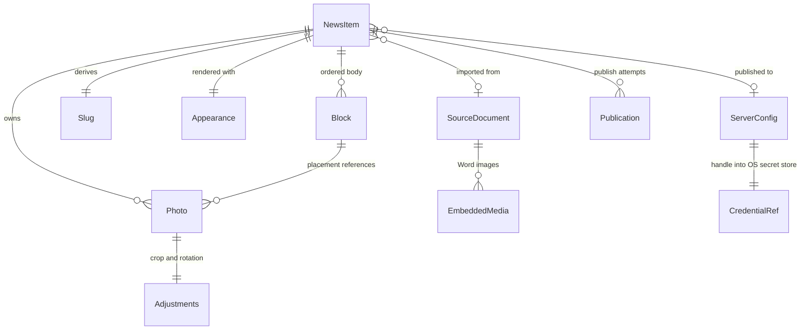
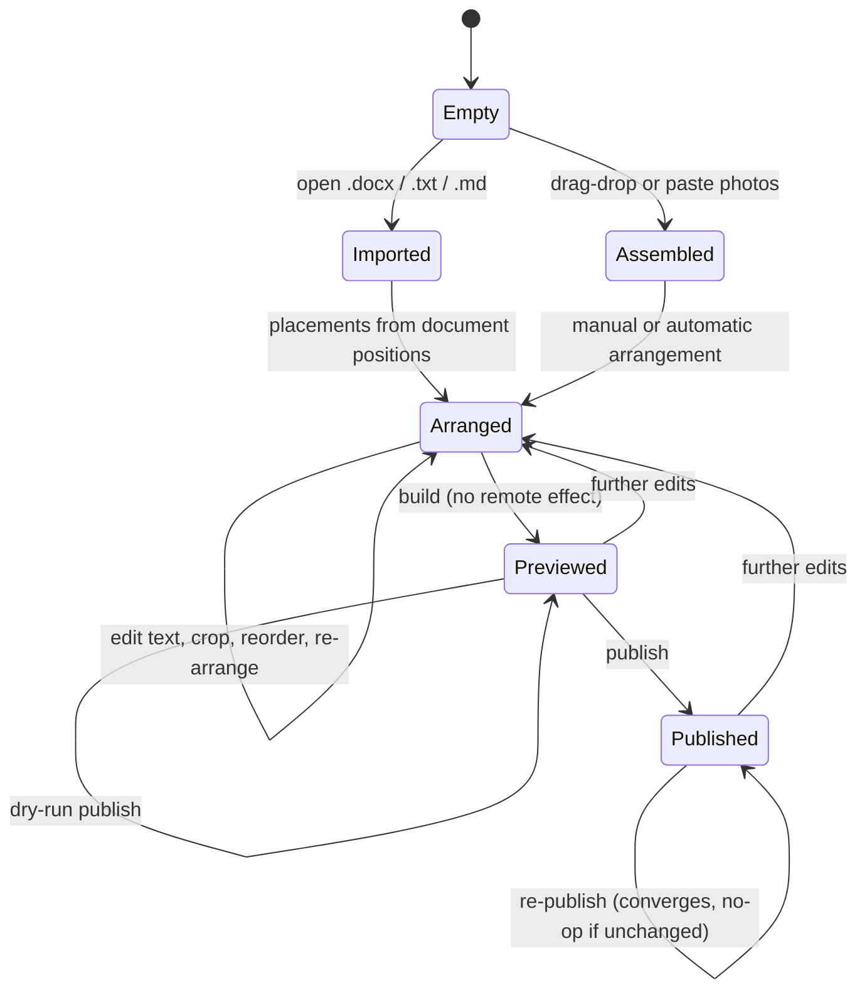

# Phase 1 Data Model: News Builder Port

**Feature**: [spec.md](./spec.md) | **Plan**: [plan.md](./plan.md) | **Date**: 2026-09-01

All types live in `crates/core/src/model/`. They are plain data: no I/O, no async, no
dependency on the CLI or the desktop shell. Every field is owned, so a `NewsItem` can be
snapshotted, compared, and rendered without touching the filesystem.

---

## NewsItem

The aggregate root. One publishable story.

| Field | Type | Notes |
|-------|------|-------|
| `title` | `String` | Non-empty. Never appears in `body` (FR-004) |
| `body` | `Vec<Block>` | Ordered paragraphs and placements |
| `photos` | `Vec<Photo>` | Ordered; index order is the identity order editors see |
| `slug` | `Slug` | Derived from `title`, overridable (FR-026) |
| `appearance` | `Appearance` | Rendering and photo-budget settings |
| `server` | `Option<ServerConfigRef>` | Absent until a target is chosen |
| `source` | `Option<SourceDocument>` | Provenance of an imported item |

**Invariants**

- Every `Placement` in `body` references photo ids that exist in `photos` (INV-1).
- `slug` is non-empty, lowercase, and matches `[a-z0-9-]+` (INV-2).
- Photo ids are unique within the item (INV-3).

**Validation** — reported as warnings, not failures, per FR-034:

- A marker naming a photo index that does not exist → `Warning::MissingPhoto { marker }`.
- A photo referenced by no placement → `Warning::UnusedPhoto { id }`. Unused photos are not
  uploaded.

---

## Block

The body is a flat ordered sequence. This mirrors the reference's `ParagraphBlock` /
`ImageLayoutBlock` split and keeps rendering a single pass.

```
Block =
  | Paragraph { text: String, kind: ParagraphKind }
  | Placement { photos: Vec<PhotoId>, layout: Layout }
```

`ParagraphKind` is `Lead` for the first paragraph or `Body` for the rest — the reference styles
these differently.

---

## Layout

```
Layout = FullWidth | Row | FloatLeft | FloatRight
```

Maps one-to-one onto the frozen marker language (FR-005):

| Layout | Marker | Photo count |
|--------|--------|-------------|
| `FullWidth` | `[image:N]` | exactly 1 |
| `Row` | `[images:N,M,...]` | 2 or more |
| `FloatLeft` | `[image-left:N]` | exactly 1 |
| `FloatRight` | `[image-right:N]` | exactly 1 |

**Invariant** (INV-4): the photo count matches the layout. A `Row` written with one photo is
normalised to `FullWidth` on import, matching reference behaviour.

---

## Photo

One image belonging to an item. Adjustments are recorded, never applied to the source
(FR-015).

| Field | Type | Notes |
|-------|------|-------|
| `id` | `PhotoId` | Stable for the item's lifetime; survives reordering and renaming |
| `origin` | `PhotoOrigin` | `Embedded { doc_order }`, `Dropped`, `Pasted`, or `Picked { path }` |
| `source` | `PhotoSource` | `Path(PathBuf)` or `Bytes(Arc<[u8]>)` — clipboard images have no path |
| `file_name` | `String` | The published name; editable (FR-009) |
| `natural_key` | `NaturalKey` | Precomputed natural-sort key for ordering |
| `dimensions` | `(u32, u32)` | After orientation is applied |
| `orientation` | `Orientation` | From EXIF (FR-016) |
| `adjust` | `Adjustments` | Editor-applied, reversible (FR-014) |

`Adjustments` holds `crop: Option<CropRect>` and `rotate: Quarters` (0–3). `Adjustments::NONE`
means the photo publishes as-is. Reverting is assignment of `NONE` — the original bytes are
never lost because they were never overwritten.

**Invariants**

- `file_name` is unique within the item; a collision gets a numeric suffix (INV-5, FR-011's
  duplicate-name edge case).
- `CropRect` lies wholly inside the oriented image bounds (INV-6).

**Ordering**: photos sort by `natural_key`, reproducing the reference's `natural_sort_key` so
that `photo2.jpg` precedes `photo10.jpg`. Ordering is total and locale-independent
(constitution IV).

---

## CropRect and framing

`CropRect { x: u32, y: u32, width: u32, height: u32 }` in oriented-image pixel space.

The default frame for a target aspect ratio is computed by `core::photo::frame`:

- If the image already matches the target, no crop.
- If cropping vertically (a portrait image into a wider frame), the excess is split **1:3**
  between top and bottom — a quarter comes off the top, three quarters off the bottom. This is
  the headroom bias of FR-013 and R5.
- If cropping horizontally, the excess is split evenly.

The rule is pure arithmetic over dimensions, so it is unit-testable without decoding an image
and is deterministic.

---

## SourceDocument

Provenance for an imported item; absent for items built from loose photos.

| Field | Type | Notes |
|-------|------|-------|
| `path` | `PathBuf` | The file the editor opened |
| `format` | `Docx \| Text \| Markdown` | |
| `embedded_media` | `Vec<EmbeddedMedia>` | Word only: bytes plus document position |

`EmbeddedMedia { rel_id: String, part_name: String, bytes: Arc<[u8]>, after_paragraph: usize }`.
`after_paragraph` is what turns a document position into a `Placement` (FR-003): media anchored
after paragraph *k* becomes a placement at that point in `body`.

---

## Appearance

Rendering and photo-budget settings. One built-in value ships (FR-025); configuration may
override it, using the reference's JSON schema so existing preset files still load — see
[contracts/appearance-config.md](./contracts/appearance-config.md).

| Field | Type | Default |
|-------|------|---------|
| `styles` | `StyleSet` | The built-in appearance |
| `max_width` | `u32` | 1600 |
| `max_bytes` | `u64` | 512000 |
| `jpeg_quality` / `jpeg_min_quality` | `u8` | 85 / 50 |
| `webp_quality` / `webp_min_quality` | `u8` | 85 / 50 |

`StyleSet` holds one inline-style string per rendering slot (`container`, `title`, `paragraph`,
`lead`, `image_wrapper`, `image`, `row_wrapper`, `row_item`, `row_image`, `float_left`,
`float_right`, `clear`), matching the reference's `DEFAULT_STYLES` keys exactly.

**Invariant** (INV-7): `min_quality <= quality`, and both fall in 1..=100.

---

## ServerConfig and ServerConfigRef

A reusable publishing target (FR-033). The credential is **not** part of it (FR-040).

| Field | Type | Notes |
|-------|------|-------|
| `name` | `String` | Unique; the key editors see |
| `host` | `String` | |
| `user` | `String` | |
| `port` | `u16` | Default 22 |
| `remote_base_path` | `String` | POSIX path; item folders are created beneath it |
| `public_base_url` | `Url` | Item URLs are built beneath it |
| `credential` | `CredentialRef` | `Key { path }` or `Password` — either way a handle into the OS secret store |

`ServerConfigRef` is the name only; `NewsItem` holds the reference, and the config is resolved
at publish time. This keeps a serialised item free of connection details.

**Invariant** (INV-8): a config resolves to a credential of one kind or the other; neither
present means publishing is refused before any photo is processed (FR-029).

---

## Slug

A newtype over `String`, produced by `core::publish::slug`.

Transliteration reproduces the reference's Cyrillic table exactly — including the
Belarusian/Ukrainian rows `і ї є ў` — then lowercases, replaces runs of non-alphanumerics with
a single hyphen, and trims hyphens. The mapping is a golden-tested table (constitution III).

**Collision**: two different titles may transliterate identically. Before upload, publishing
probes the remote base path; an existing folder that belongs to a different item gets a numeric
suffix rather than being written into (the spec's slug-collision edge case).

---

## BuildOutput

What `core::build` returns. Not persisted — recomputed from the item on every change, which is
what makes the preview and the export the same artefact (FR-022, FR-023).

| Field | Type | Notes |
|-------|------|-------|
| `fragment` | `String` | The inline-styled HTML for the CMS |
| `processed` | `Vec<ProcessedPhoto>` | Bytes, final name, final size, applied quality |
| `warnings` | `Vec<Warning>` | Per-photo and per-marker problems (FR-034) |

**Determinism** (constitution IV): identical `NewsItem` plus identical `Appearance` yields a
byte-identical `fragment`. Nothing in the build reads the clock, the locale, or hash iteration
order. Ordered collections are used throughout; no `HashMap` iteration reaches the output.

---

## Publication

The record of one publish attempt, kept for reporting and for convergence.

| Field | Type | Notes |
|-------|------|-------|
| `remote_folder` | `String` | `remote_base_path` + `/` + `slug` |
| `uploaded` | `Vec<(String, Url)>` | File name → public URL |
| `dry_run` | `bool` | True when no remote mutation occurred (FR-031) |
| `warnings` | `Vec<Warning>` | |

**Convergence** (FR-030): publishing computes the desired remote file set from the item, lists
what is present, and uploads only what differs. Re-publishing an unchanged item performs no
writes, which is what SC-009 asserts.

Publishing **never deletes** (deviation D-7). A photo dropped from an item stays on the server
as an orphan; the fragment simply stops referencing it. There is no delete operation anywhere in
the publish path — see the `Transport` trait, which has no removal method.

---

## Entity relationships



---

## State transitions

A news item moves through the desktop application as follows. The CLI enters at **Arranged**
and may only move right (FR-037, FR-038).



`Previewed` is not a stored state — it is the presence of a fresh `BuildOutput`. Any edit
invalidates it, which is why the build is cheap enough to run on every change (SC-008).
